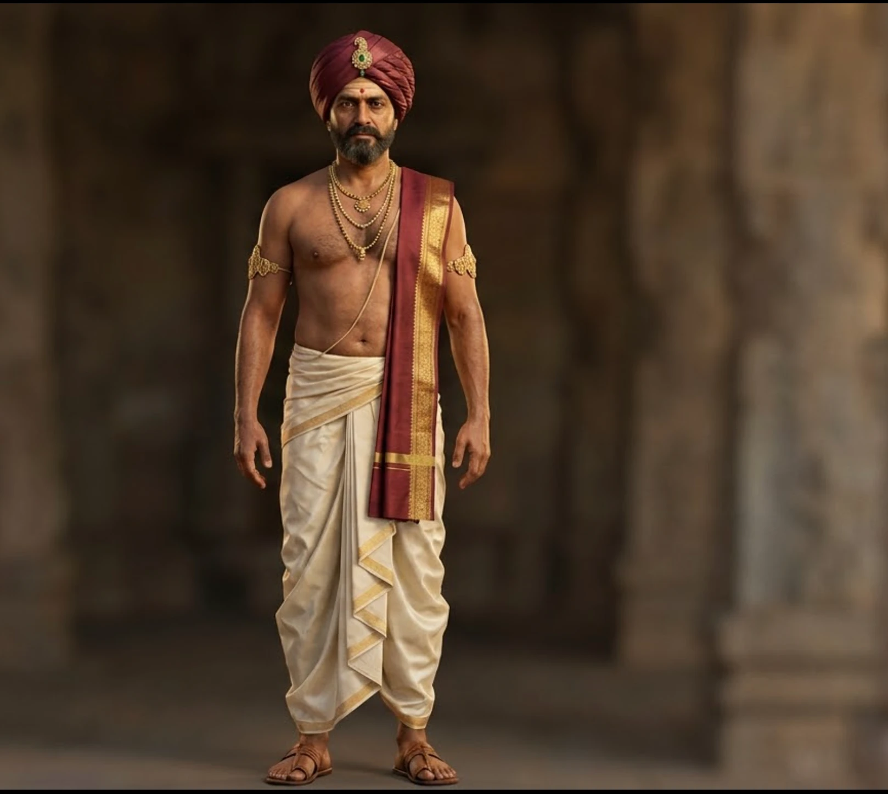

# Narrator-King — Character Reference Sheet

Use this file alongside the locked reference image for every generation (Nano Banana Pro image input, or as a text fallback if no image-reference feature is available). Keep this description identical across all 13 images and 8 videos — this is what keeps the character from drifting.

## Reference Image (locked)

`reference-images/01-front-full-body.webp` — attach this as the image-reference input in Nano Banana Pro for every subsequent generation.

---

## Character Description

**Name/role:** "Rayaraya" — a composite Deccan ruler-narrator, loosely modeled on the founding Vijayanagara kings (Harihara I / Bukka Raya, ascending ~1336), used as the on-camera host across the Kaalchakra SIH pitch/demo videos.

**Framing device:** He addresses the viewer directly, as if reading from a royal chronicle that becomes the game itself — inviting the viewer to make the same choices his kingdom once faced.

**Personality:** Measured, warm but commanding — a ruler who has watched empires rise and fall over 150 years and is now inviting the viewer to steer the same history. Calm authority rather than aggression; persuasive through conviction, not volume.

**Voice/delivery:** Measured pace, warm but firm tone, clear diction. Speaks like a statesman narrating history he lived through, not a salesman pitching a product. Grave and serious for stakes/consequences, subtly warm for invitation/closing moments (see the expression table in the production plan for which beats use which tone).

**Narrative purpose:** Ties together the pitch video's emotional beats — hook, problem, concept, mechanics, regions, consequence, tech pitch, closing CTA — so the viewer experiences the pitch as being personally addressed by history itself, not a generic voiceover.

## Acting Direction (apply to every video clip)

**Default state — stillness.** He is not a fidgety or animated performer. Every clip opens on a still, grounded posture and returns to one before the clip ends. No swaying, no repeated weight-shifting, no idle hand movement between lines.

**Gaze — locked, level, unbroken.** Eyes stay on the lens for the entire clip, as if speaking to one specific person, not a crowd. Chin held level — not tilted up (reads as arrogant) and not tilted down (reads as submissive). He never glances away, even mid-gesture.

**Pacing — unhurried.** He speaks like someone with nothing to prove and nowhere to be — measured cadence, deliberate pauses between clauses, no rushed delivery. Silence before a key line is used deliberately, not filled.

**Blinking and breathing — slow and minimal.** A slow, deliberate blink rate (not the rapid/twitchy blinking video models default to) and a barely visible, calm breathing rhythm in the chest — reinforces composure rather than nervousness.

**Gesture economy — one motion per clip, then stop.** At most one hand/arm movement per clip, timed to reinforce the meaning of a specific line (an open palm on an invitation, a slight forward lean on the hook). The gesture completes once, holds briefly, then returns to a resting position and stays still for the remainder of the clip — never looped, never repeated, never fidgeted.

**Emotional range — narrow and controlled, not theatrical.** He doesn't perform big emotions:
- *Grave/still* for stakes and consequences — brow slightly set, no movement, low measured tone.
- *Warm but restrained* for invitation and closing beats — the corners of the mouth may lift slightly, never a full smile.
- *Matter-of-fact, steady* for exposition/mechanics beats — closest to his neutral resting state.

**What to avoid:** exaggerated facial expressions, raised-voice energy, darting eyes, repeated/looping gestures, nervous fidgeting, smiling outside the designated warm beats, camera-breaking glances.

## Identity (must not change between generations)

- **Role:** South Indian Deccan ruler, Vijayanagara-era (Kaalchakra narrator character)
- **Age:** 48
- **Face shape:** Square jaw, broad forehead, medium-set brown eyes, thick straight eyebrows
- **Beard:** Full, dense beard covering the entire jawline, chin, and both cheeks up to the cheekbones, connected seamlessly to a full mustache — not a mustache-only or patchy look. Uniform medium-short length (~2cm). Color roughly 70% black / 30% grey, with the grey concentrated at the sideburns and chin rather than evenly scattered.
- **Build:** Medium-tall, broad-shouldered, warrior's upright posture
- **Skin:** Warm bronze tone, clearly visible individual pores on the cheeks and nose, fine creases at the outer corners of the eyes, faint sheen on the forehead and collarbones
- **Neck/chest:** Bare skin between and around the necklaces — no thread, string, chain, or cord besides the necklaces described below

## Costume (must not change between generations)

- **Turban:** Soft maroon silk, wound cloth folds with visible fabric creases, single gold-and-emerald ornament pinned at the center front. This is a fabric turban — NOT a rigid metal crown, tiara, or circlet. No hard metal band anywhere on the head.
- **Lower garment:** Men's ivory silk dhoti — cloth wound around the waist and both legs like loose trousers, reaching the ankles, pleated front fold. This is a man's dhoti — NOT a woman's saree. No pallu drape hanging loose over the chest or shoulder.
- **Upper garment:** Maroon-and-gold silk angavastram shawl draped diagonally across the bare chest and over one shoulder — the only cloth crossing the torso.
- **Jewelry:** Layered gold necklaces (three graduated strands), gem-studded gold armlets on both upper arms.
- **Footwear:** Simple leather sandals.

## Material detail (must not change between generations)

- Turban fabric shows individual visible wrinkles and fold lines
- Dhoti and angavastram show visible woven silk thread structure with fine gold-thread embroidery along the borders
- Gold jewelry shows individually engraved micro-patterns and sharp specular point-reflections on each facet

## Camera & gaze (must not change unless the pose table says otherwise)

- Camera at the character's own eye level — not low-angle, not high-angle
- Locked-off static shot, 50mm lens equivalent, minimal distortion
- Eyes look directly into the camera lens the entire time, as if speaking one-on-one to the viewer — never glancing up, down, or to the side (exception: image #12, the scroll-reading cutaway, where eyes are intentionally down)

## Standard negative constraints (include every time)

Do not render: a metal crown, tiara, or circlet; a woman's saree or any pallu drape over the chest; a cropped frame that excludes the feet (for full-body shots); letterboxing or black bars around the image; smooth/plastic-looking skin with no visible pore texture; any loose chain, thread, or cord on the bare chest besides the necklaces; a watermark or logo anywhere in frame.

---

For the full pose-by-pose prompt list, generation order, and video-clip plan, see [`character-production-plan.md`](../../character-production-plan.md).
